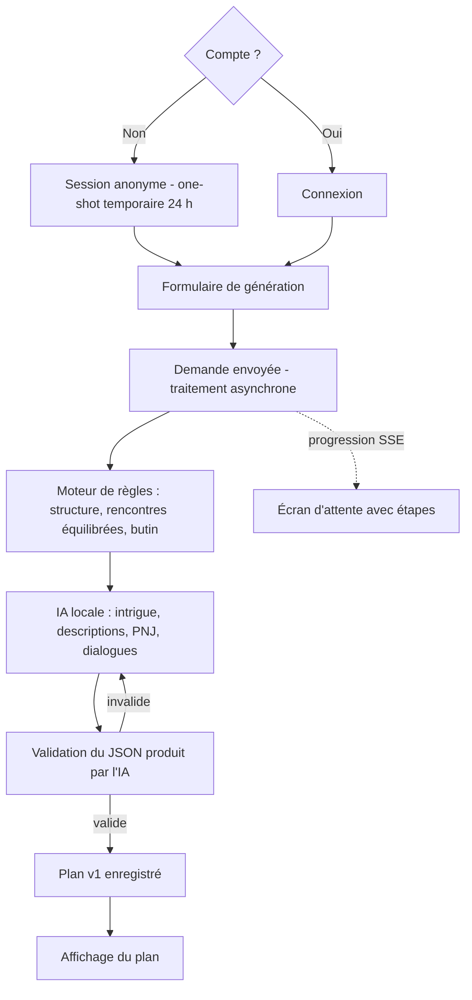
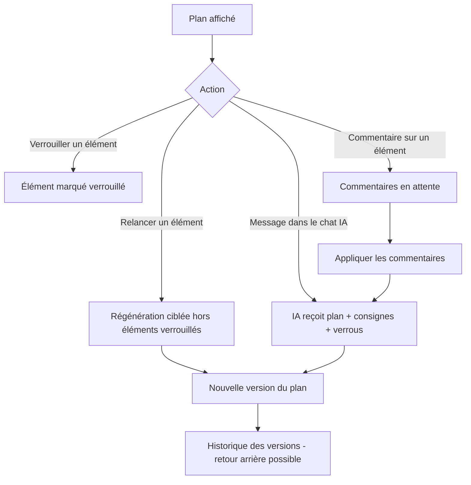
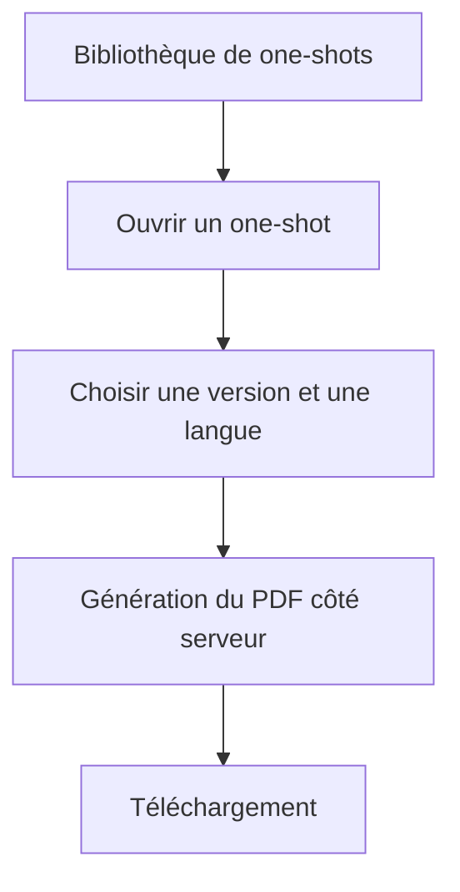

# Définition du produit : générateur de one-shots de jeu de rôle

Ce document correspond à l'étape 1 du [guide de développement](../GUIDE-DEVELOPPEMENT-END-TO-END.md).

Contexte : il s'agit d'un projet d'apprentissage. L'objectif principal est de maîtriser le
backend, le frontend et le DevOps, avec un niveau d'exigence maximal sur la qualité.

> Point juridique : l'application ne doit reprendre ni la marque « Dungeons & Dragons »,
> ni les noms protégés (par exemple *Beholder*, *Mind Flayer*, *Forgotten Realms*), ni les
> textes des livres officiels. Le SRD (CC-BY-4.0) sert uniquement d'inspiration. Les
> prompts envoyés à l'IA demandent explicitement du contenu original.

---

## 1. Vision produit

**Pour** les maîtres du jeu (MJ), ainsi que les joueurs qui veulent se lancer comme MJ,
**qui** manquent de temps ou d'expérience pour préparer une séance complète,
**le générateur de one-shots** est une application web
**qui** produit un plan de partie d'environ 3 heures (intrigue, scènes, rencontres, PNJ et
butin) à partir d'une description libre et de quelques paramètres,
**contrairement aux** générateurs de tables aléatoires isolés ou aux IA conversationnelles
généralistes,
**notre produit** combine un moteur de règles fiable (équilibrage, structure) et une IA
locale pour la narration. Il permet ensuite d'affiner le plan par chat puis de l'exporter
en PDF imprimable.

### Objectifs
- Générer un one-shot jouable, cohérent et équilibré en quelques minutes.
- Adapter le niveau de détail à l'expérience du MJ (textes à lire, rappels de règles,
  conseils) et à celle des joueurs (accroches explicites, aides de jeu, difficulté plus clémente).
- Permettre d'essayer sans compte, puis de créer un compte pour sauvegarder.
- Fonctionner quel que soit le système de jeu : règles de type 5e, règles allégées, ou
  univers inventé.
- Rester gratuit à exploiter grâce à un LLM local et un hébergement cloud gratuit.

### Hors périmètre
- Campagnes et continuité entre séances (one-shots uniquement).
- Temps réel et partage en direct avec les joueurs.
- Contenu sous droits (textes, noms ou univers officiels).
- Édition manuelle du texte du plan : toute modification passe par un commentaire ou le chat IA.
- Paiement, application mobile native, gestion formelle du backlog.

---

## 2. Utilisateurs

| Persona | Besoins |
|---|---|
| **MJ expérimenté** | Gagner du temps, obtenir un plan concis et modifiable, utiliser ses propres monstres, tables et PNJ. |
| **Joueur qui débute comme MJ** | Plan très détaillé : textes d'ambiance à lire, rappels de règles, conseils d'improvisation, solutions de repli. |

| **Visiteur anonyme** | Tester le générateur sans créer de compte. |

Rôles applicatifs :
- `ANONYMOUS` : génération et affinage d'un one-shot temporaire (expire au bout de 24 h), export PDF,
  sans bibliothèque ni contenu personnel.
- `USER` : toutes les fonctionnalités, avec sauvegarde.
- `ADMIN` : exploitation (supervision, modération des contenus).

---

## 3. Parcours utilisateurs

### 3.1 Générer un one-shot



### 3.2 Affiner le plan



### 3.3 Retrouver et exporter



---

## 4. Paramètres de génération

| Paramètre | Valeurs |
|---|---|
| Description libre | Texte (thème, envies, contraintes), limité en longueur |
| Système de règles | `TYPE_5E` (équilibrage selon un budget d'XP), `ALLEGE` (difficulté qualitative), `NARRATIF` (sans statistiques) |
| Niveau des personnages | 1 à 20 (ignoré en mode `NARRATIF`) |
| Taille du groupe | 1 à 8 |
| Durée | 2 h, 3 h (par défaut) ou 4 h |
| Ton | Épique, horreur, humour, mystère, etc. (plusieurs choix possibles) |
| Environnement | Donjon, forêt, ville, mer, montagne, plan étrange, etc. |
| Répartition | Pourcentages combat / exploration / roleplay (total de 100) |
| Expérience du MJ | Débutant, intermédiaire ou expert : détermine le niveau de détail pour le MJ |
| Expérience des joueurs | Débutants, mixtes ou confirmés : accroches plus ou moins explicites, aides de jeu et rappels à destination des joueurs, marge de difficulté |
| Contenu personnel | Monstres, tables ou PNJ de l'utilisateur à utiliser en priorité |
| Langue | FR ou EN |
| Graine (optionnelle) | Entier qui permet de rejouer à l'identique la partie produite par le moteur de règles |

---

## 5. Fonctionnalités du MVP

### Épique A : compte
- A1. Inscription et connexion par email et mot de passe (Argon2 ou BCrypt).
- A2. Jeton d'accès JWT de courte durée et jeton de rafraîchissement (refresh token) avec rotation, stocké dans un cookie HttpOnly.
- A3. Profil : langue préférée, suppression du compte et de toutes ses données.
- A4. Mode anonyme : jeton JWT `ANONYMOUS` émis après une vérification anti-robot (Cloudflare Turnstile). Le one-shot est conservé 24 h puis purgé.
- A5. Rattachement : en créant un compte, le visiteur anonyme récupère son one-shot en cours.

### Épique B : génération
- B1. Formulaire de génération validé côté client (Zod) et côté serveur (Bean Validation).
- B2. Moteur de règles : gabarit de scènes selon la durée et la répartition, budget de
  rencontres selon le système, le niveau et la taille du groupe, tirage du butin et des
  éléments aléatoires avec la graine.
- B3. Enrichissement par l'IA locale (Ollama via Spring AI) avec une sortie JSON structurée
  et validée, et des relances limitées si le JSON est invalide.
- B4. Traitement asynchrone, avec progression envoyée au navigateur en SSE (Server-Sent Events).
- B5. Limite du nombre de générations simultanées et par jour pour chaque utilisateur.

### Épique C : affinage
- C1. Verrouiller ou déverrouiller un élément (scène, rencontre, PNJ, objet).
- C2. Relancer un élément seul.
- C3. Chat IA de modification avec réponse diffusée au fil de l'eau (streaming). Les éléments verrouillés restent intacts.
- C4. Versions du plan : chaque modification crée une version. On peut consulter et restaurer une version précédente.
- C5. Commentaires ciblés : l'utilisateur annote un élément (scène, PNJ, rencontre, etc.), puis
  applique en une fois tous les commentaires en attente, ce qui produit une nouvelle version.

### Épique D : contenu personnel
- D1. Créer, modifier et supprimer des monstres (statistiques optionnelles selon le système).
- D2. Créer, modifier et supprimer des tables aléatoires pondérées.
- D3. Créer, modifier et supprimer des PNJ.
- D4. Le contenu personnel reste privé et seul son propriétaire y a accès.

### Épique E : bibliothèque et export
- E1. Liste paginée des one-shots, avec recherche et suppression.
- E2. Export PDF imprimable en français ou en anglais (HTML vers PDF côté serveur).

### Épique F : internationalisation
- F1. Interface en français et en anglais (react-i18next).
- F2. Messages d'erreur de l'API traduits (`MessageSource`, en-tête `Accept-Language`).
- F3. Le contenu est généré dans la langue choisie.

---

## 6. Règles métier

- RM1. Le total de la répartition combat / exploration / roleplay vaut toujours 100 %.
- RM2. En mode `TYPE_5E`, la difficulté cumulée des rencontres reste dans le budget quotidien
  calculé pour le groupe. En mode `ALLEGE`, la difficulté est qualitative (facile, moyen, difficile).
- RM3. Un élément verrouillé n'est jamais modifié, ni par une relance, ni par le chat.
- RM4. Avec la même graine et les mêmes paramètres, le moteur de règles produit le même squelette.
- RM5. Le JSON produit par l'IA est validé contre un schéma avant d'être enregistré. Il n'est
  jamais affiché sans échappement ou nettoyage (sanitization).
- RM6. Un utilisateur n'accède qu'à ses propres one-shots et à son propre contenu.
- RM7. Le PDF est régénéré à la demande à partir de la version enregistrée (aucun fichier stocké).
- RM8. Le texte du plan n'est jamais modifié directement par l'utilisateur, uniquement par le
  moteur de règles ou l'IA (via une relance, un commentaire ou le chat).
- RM9. Si les joueurs sont débutants, le moteur abaisse la difficulté d'un cran et l'IA ajoute
  des aides de jeu (rappels de règles et d'objectifs à lire aux joueurs).
- RM10. Un one-shot anonyme expire 24 h après sa dernière modification. Un utilisateur anonyme
  ne peut avoir qu'un seul one-shot actif et a droit à 3 générations par jour et par IP.

---

## 7. Exigences non fonctionnelles

| Domaine | Exigence |
|---|---|
| Sécurité | OWASP Top 10. Mitigation de l'injection de prompt : le texte de l'utilisateur est isolé et non considéré comme une instruction, la sortie est validée. Limitation du nombre de requêtes (rate limiting) par utilisateur et par IP pour le mode anonyme. Anti-robot (Turnstile). En-têtes de sécurité. Dépôt public : aucun secret versionné (gitleaks en CI). |
| Performance | Génération complète en 10 min maximum sur le CPU du serveur gratuit, avec progression visible. Modification (chat, commentaires, relance) en 3 min maximum. API CRUD : p95 inférieur à 300 ms. Valeurs à mesurer dès l'étape 7. |
| Disponibilité | Service au mieux (best effort, offre gratuite). Vérifications de santé (health checks) et redémarrage automatique. |
| Qualité | Couverture de tests de 80 % ou plus, tests de mutation, analyse Sonar sans nouveau problème, linting bloquant en CI. |
| Données personnelles (RGPD) | Données minimales (email et mot de passe haché). Suppression complète du compte. |
| Accessibilité | Viser WCAG 2.1 AA. |

---

## 8. Critères d'acceptation (exemples)

**B2/B3 : générer un one-shot**
- *Étant donné* un utilisateur connecté,
  *quand* il envoie une demande valide (3 h, 4 personnages de niveau 3, `TYPE_5E`),
  *alors* un plan est produit avec 4 à 6 scènes, des rencontres qui respectent le budget
  d'XP, au moins 3 PNJ et du butin, dans la langue choisie.

**RM4 : graine**
- *Étant donné* la même graine et les mêmes paramètres,
  *quand* le moteur de règles est exécuté deux fois,
  *alors* les deux squelettes sont identiques.

**C1/C3 : verrouillage**
- *Étant donné* un PNJ verrouillé,
  *quand* l'utilisateur demande dans le chat « change tous les PNJ »,
  *alors* ce PNJ reste inchangé dans la nouvelle version.

**E2 : export**
- *Étant donné* un one-shot enregistré,
  *quand* l'utilisateur demande le PDF en anglais,
  *alors* un PDF A4 imprimable est téléchargé, avec une table des matières et une page par scène.

---

## 9. Stack technique retenue

| Couche | Choix |
|---|---|
| Frontend | React, TypeScript, Vite, React Router, TanStack Query, React Hook Form, Zod, react-i18next, Vitest, Testing Library, Playwright, ESLint, Prettier |
| Backend | Java 25, Spring Boot, Spring Web, Spring Security (serveur de ressources OAuth2 avec JWT signés localement), Spring Data JPA, Bean Validation, Spring AI (Ollama), springdoc-openapi, openhtmltopdf avec Thymeleaf |
| Données | PostgreSQL (métadonnées relationnelles et plans stockés en JSONB), Flyway |
| IA | Ollama, modèle de 7-8 milliards de paramètres quantifié (par exemple `qwen2.5:7b` ou `llama3.1:8b`), sortie structurée |
| Qualité backend | JUnit 5, Mockito, AssertJ, Testcontainers, ArchUnit, JaCoCo, PIT (mutation), Spotless, Checkstyle, SpotBugs |
| CI/CD | Dépôt GitHub public, GitHub Actions, SonarQube Cloud, Dependabot, CodeQL, Trivy, gitleaks, GHCR |
| Déploiement | Oracle Cloud Always Free (VM ARM de 4 OCPU et 24 Go de RAM) avec Docker Compose et Caddy (HTTPS automatique) |
| Observabilité | Actuator, Micrometer, Prometheus, Grafana, logs JSON |

### Architecture backend

```text
com.oneshot
├── controller/      entrées HTTP et gélégation
├── dto/             contrats d'entrée et de sortie
├── mapper/          conversions entre contrats et modèles
├── model/           objets-valeurs et modèles de persistance distincts
├── service/         interfaces des services
├── implementation/  implémentations et politiques métier
└── repository/      accès aux données persistées
```

L'ADR-0010 remplace l'organisation par module en une organisation en couche.

---

## 10. Feuille de route technique

1. Définition du produit (ce document) et maquettes (voir section 11).
2. Architecture ([02-ARCHITECTURE.md](02-ARCHITECTURE.md)) : décisions techniques documentées (ADR), schéma de base de données, contrat OpenAPI, schéma JSON du plan.
3. Environnement : monorepo, Docker Compose de développement (PostgreSQL et Ollama), squelettes backend et frontend.
4. CI dès le départ : build, linting, tests, couverture, Sonar et analyse de sécurité, bloquants.
5. Identité : inscription, connexion, JWT, refresh token.
6. Moteur de règles avec graine, à 100 % de couverture et testé par mutation.
7. Intégration de l'IA : prompts, sortie structurée, validation, traitement asynchrone et SSE.
8. Frontend : formulaire, attente de génération, affichage du plan.
9. Affinage : verrous, relance, chat en streaming, versions.
10. Contenu personnel.
11. Bibliothèque et export PDF.
12. Internationalisation complète.
13. Tests de bout en bout Playwright.
14. Déploiement sur Oracle Cloud (CD vers la VM, sauvegardes PostgreSQL).
15. Observabilité : tableaux de bord et alertes.

---

## 11. Maquettes

Planche générée par IA, à ranger dans `maquettes/planche-v1.png`. Écrans couverts : accueil,
authentification, formulaire, attente, plan, chat, versions, bibliothèque, contenu personnel,
profil, aperçu PDF, états (vide, chargement, erreur, succès), composants et responsive.

Écarts relevés sur la version 1, pris en compte dans la version 2 (`maquettes/planche-v2.png`) :
- Formulaire : ajouter l'étape « Expérience des joueurs ».
- Accueil et connexion : ajouter un bouton « Essayer sans compte » et, en mode anonyme, un
  bandeau « One-shot temporaire, expire dans X h : créer un compte pour le sauvegarder ».
- Plan : remplacer tout champ éditable par un bouton « Commenter » sur chaque élément, un
  compteur de commentaires en attente et un bouton « Appliquer les commentaires ».
- Mode anonyme : masquer la bibliothèque et le contenu personnel dans la navigation.

Remarques sur la version 2, à appliquer lors du développement du frontend :
- Le panneau de chat apparaît deux fois sur l'écran du plan : ne garder que le tiroir latéral droit.
- Le formulaire compte 12 étapes : les regrouper en 4 (Aventure : description, tons,
  environnement ; Groupe : système, niveau, taille, expérience des joueurs ; Séance : durée,
  répartition, expérience du MJ ; Options : contenu personnel, langue, graine).
- Inscription : afficher « 12 caractères minimum » (voir ADR-0003) au lieu de 8.
- Ajouter le widget anti-robot sur l'inscription et sur « Essayer sans compte ».

---

## 12. Points ouverts

| Sujet | Décision provisoire |
|---|---|
| Nom de l'application | Nom de code `oneshot` (package `com.oneshot`). Le nom définitif se change dans l'i18n et la configuration uniquement. |
| Modèle Ollama en local | À choisir selon la machine de développement. Le modèle est paramétrable (`app.ai.model`) et un profil `dev-light` utilise un modèle de 3 milliards de paramètres. |
