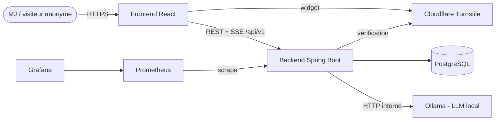
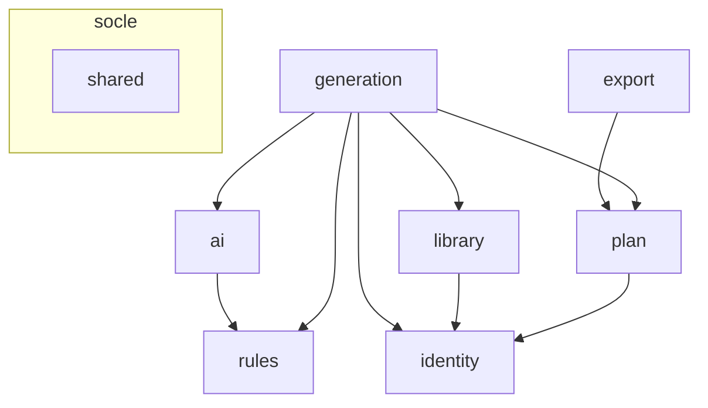
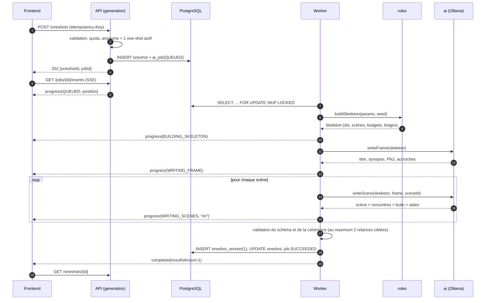
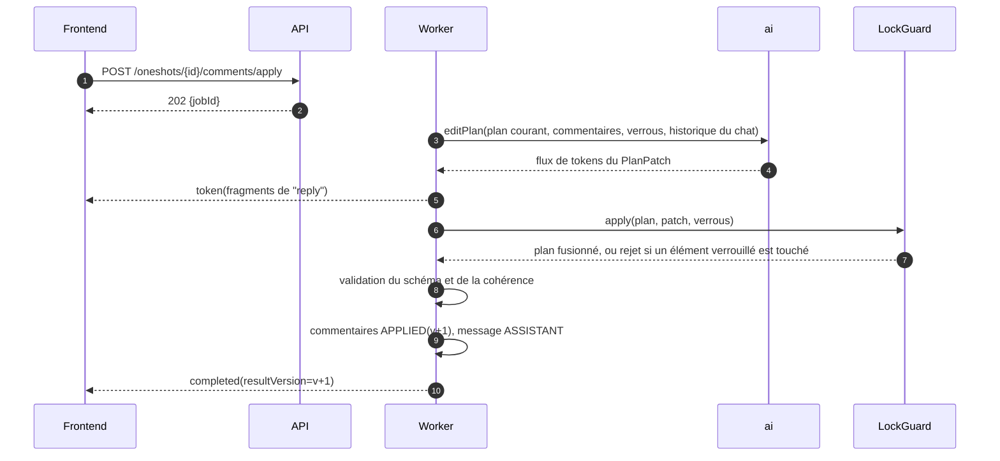
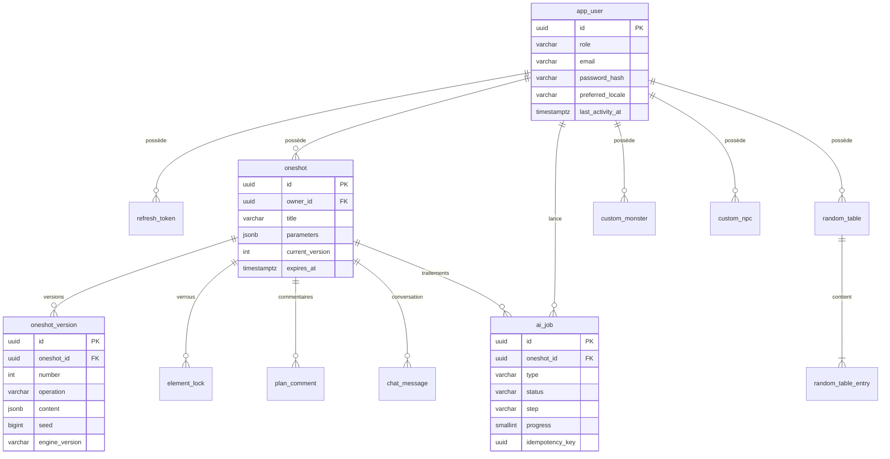
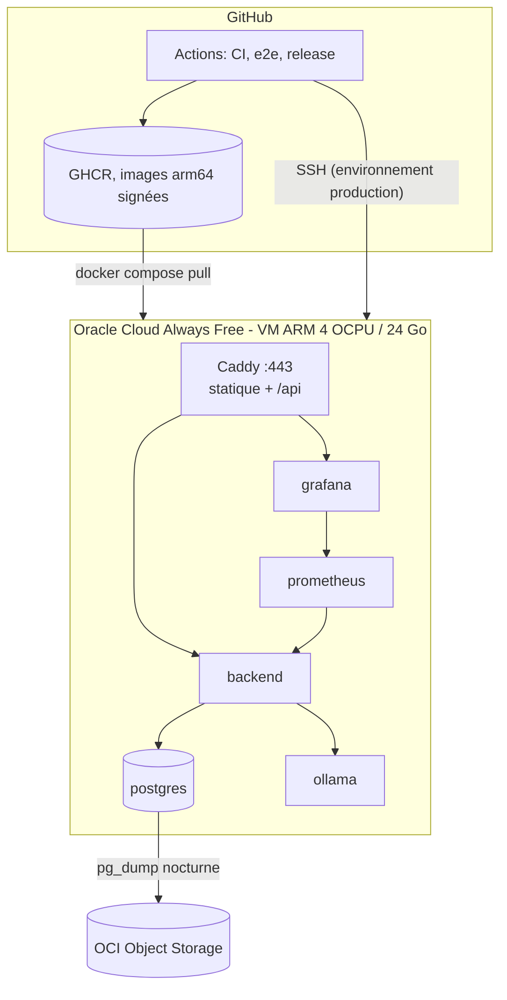

# Architecture : générateur de one-shots

Ce document correspond à l'étape 2 du [guide de développement](../GUIDE-DEVELOPPEMENT-END-TO-END.md).
Il s'appuie sur la [définition du produit](01-DEFINITION-PRODUIT.md).

| Livrable | Emplacement |
|---|---|
| Décisions d'architecture (ADR) | [docs/adr/](docs/adr/) |
| Contrat d'API | [docs/api/openapi.yaml](docs/api/openapi.yaml) |
| Schéma du plan de partie | [docs/schemas/plan.schema.json](docs/schemas/plan.schema.json) |
| Schéma de base de données | [docs/database/V1__init.sql](docs/database/V1__init.sql) |

## Index des ADR

| N° | Décision |
|---|---|
| [0001](docs/adr/0001-monolithe-modulaire-monorepo.md) | Décision initiale remplacé par l'ADR-0010 |
| [0002](docs/adr/0002-contract-first-openapi.md) | Contrat d'API d'abord (OpenAPI 3.1 et JSON Schema), génération de code |
| [0003](docs/adr/0003-authentification-jwt.md) | JWT RS256, refresh token rotatif en cookie, mode anonyme convertible |
| [0004](docs/adr/0004-generation-hybride-regles-ia.md) | Moteur de règles déterministe et IA locale découpée en plusieurs appels, modifications par patch |
| [0005](docs/adr/0005-file-de-jobs-et-sse.md) | File de jobs PostgreSQL (`SKIP LOCKED`) et progression en SSE |
| [0006](docs/adr/0006-plan-jsonb-versionne.md) | Plan stocké en JSONB versionné, verrous et commentaires relationnels |
| [0007](docs/adr/0007-export-pdf.md) | PDF côté serveur avec Thymeleaf et openhtmltopdf |
| [0008](docs/adr/0008-hebergement-et-cicd.md) | Oracle Cloud Always Free, Docker Compose, Caddy, GitHub Actions |
| [0009](docs/adr/0009-strategie-qualite.md) | Seuils de qualité bloquants |
| [0010](docs/adr/0010-architecture-en-couches.md) | Monolithe en couches techniques globales, contrats de service et migration du code |

---

## 1. Vue de contexte



## 2. Organisation du monorepo

```text
oneshot/
├── backend/                 Maven, Java 25, Spring Boot 4.x
│   └── src/main/java/com/oneshot/
│       ├── controller/      entrées HTTP et gélégation
│       ├── dto/             contrats d'entrée et de sortie
│       ├── mapper/          conversions entre contrats et modèles
│       ├── model/           objets-valeurs et modèles de persistance distincts
│       ├── service/         interfaces des services
│       ├── implementation/  implémentations et politiques métier
│       └── repository/      accès aux données persistées
├── frontend/                Vite, React, TypeScript
│   └── src/
│       ├── app/             routeur, providers, layout
│       ├── api/             types générés (openapi-typescript), client, intercepteur de refresh
│       ├── features/        auth, generation, plan, chat, versions, library, profile
│       ├── components/ui/   shadcn/ui + Tailwind (bibliothèque des maquettes)
│       └── i18n/            fr.json, en.json
├── infra/
│   ├── compose.dev.yml      postgres, ollama
│   ├── compose.prod.yml     caddy, backend, postgres, ollama, prometheus, grafana
│   ├── caddy/Caddyfile
│   └── observability/       prometheus.yml, tableaux de bord Grafana
├── docs/                    ce dossier (ADR, API, schémas, base de données)
└── .github/workflows/       ci.yml, e2e.yml, release.yml, backup-restore-test.yml
```
Cette arborescence est la cible acceptée dans l'ADR-0010.

## 3. Dépendances entre fonctionnalités



Le diagramme décrit les collaborations métier, pas des packages racines à créer.
Les fonctionnalités communiquent via les interfaces de service et leurs contrats.
Les controllers n'accèdent pas directement aux repositories, les mapper ne portent
pas la logique métier. Les dépendances cycliques entre fonctionnalités sont interdites.
Le moteur de règles, ses modèles et ses contrats restent en Java pur : aucune dépendance
à Spring, JPA, aux repositories ou aux DTO OpenApi. Ces contraintes seront vérifiées par
ArchUnit sur les types concernés, et non sur un ancien package `rules` inexistant après
migration. LEs classes Spring ou JPA d'autres fonctionnalités ne changent pas cette
contrainte. L'ADR-0010 précise le plan de migration et les destinations.

## 4. Pipeline de génération



**Budget de progression** (valeurs indicatives) : squelette de 0 à 5 %, cadre de 5 à 25 %,
scènes de 25 à 90 % (réparties à parts égales), validation et enregistrement de 90 à 100 %.

## 5. Modifications : chat, commentaires et relance



- **LockGuard** : si le patch modifie ou supprime un élément verrouillé, cette partie est
  ignorée et signalée dans `reply`. Après fusion, le guard vérifie par comparaison que
  chaque sous-arbre verrouillé est strictement identique à la version précédente.
- **Relance (reroll)** : `rules` refait les tirages de l'élément (rencontre ou butin) avec une
  graine dérivée, puis l'IA réécrit uniquement cet élément (`PlanElement`) en recevant le
  contexte résumé du plan.
- **Chat sans modification** : si `upserts` et `deletions` sont vides, aucune version n'est créée.

## 6. Modèle de données



Le détail complet se trouve dans [V1__init.sql](docs/database/V1__init.sql). Trois points
de conception à retenir :
- UUID v7 (`uuidv7()` de PostgreSQL 18) : ils sont triables par date et limitent la fragmentation des index.
- Contraintes `CHECK` plutôt que types `ENUM` PostgreSQL : elles se modifient plus
  facilement par une migration.
- Index partiels : file d'attente, job actif unique par one-shot, commentaires en attente.

## 7. Sécurité

### Matrice des droits

| Ressource | Public | ANONYMOUS | USER | ADMIN |
|---|---|---|---|---|
| `/auth/*` | oui | oui | oui | oui |
| `GET /me`, `DELETE /me` | – | oui | oui | oui |
| `PATCH /me` | – | – | oui | oui |
| `POST /oneshots` | – | 1 actif, 3/jour/IP | 20/jour | illimité |
| `GET /oneshots` (bibliothèque) | – | – | les siens | les siens |
| `/oneshots/{id}/**`, `/jobs/{id}/**` | – | les siens | les siens | les siens |
| `/library/**` | – | – | les siens | les siens |
| `/actuator/health` | oui | – | – | – |
| `/actuator/prometheus` | réseau interne uniquement | – | – | – |

Un accès au one-shot d'un autre utilisateur renvoie **404** et non 403, pour ne pas révéler
son existence. Le contrôle de propriété est fait dans le service (`ownerId = sub`), et non
seulement au niveau de l'URL.

### Mesures principales (OWASP Top 10)

| Risque | Mesure |
|---|---|
| A01 Contrôle d'accès | Propriétaire vérifié dans chaque service, tests d'accès croisés entre deux utilisateurs |
| A02 Cryptographie | Argon2id, RS256, refresh token haché, HTTPS obligatoire, IP stockée en HMAC |
| A03 Injection | JPA paramétré ; prompt : texte utilisateur délimité, IA sans outils, sortie validée par schéma ; échappement dans le PDF et React (pas de `dangerouslySetInnerHTML`) |
| A04 Conception | Quotas, limite de débit, jobs uniques, idempotence, limites de taille sur toutes les entrées |
| A05 Configuration | Profils Spring séparés, Actuator restreint, en-têtes CSP/HSTS dans Caddy, erreurs sans pile d'appels |
| A06 Composants vulnérables | Dependabot, Trivy, CodeQL |
| A07 Authentification | Limite de débit sur les tentatives de connexion, Turnstile, message d'erreur générique, rotation et détection de réutilisation des refresh tokens |
| A08 Intégrité | Images signées (cosign), actions GitHub épinglées par SHA |
| A09 Journalisation | Logs JSON avec `userId` et `jobId`, jamais de mot de passe, jeton ni contenu de prompt |
| A10 SSRF | URL d'Ollama fixée par la configuration, résolveur d'URI du PDF limité au classpath |

## 8. Configuration

| Propriété | Dev | Prod | Rôle |
|---|---|---|---|
| `app.ai.base-url` | `http://localhost:11434` | `http://ollama:11434` | Ollama |
| `app.ai.model` | profil `dev-light` : 3 milliards de paramètres | 7-8 milliards de paramètres | Modèle |
| `app.ai.timeout` | 5m | 10m | Délai maximal par appel |
| `app.ai.max-retries` | 2 | 2 | Relances en cas de JSON invalide |
| `app.jobs.worker-threads` | 1 | 1 | Inférences en parallèle |
| `app.jobs.poll-interval` | 1s | 1s | Intervalle de scrutation de la file |
| `app.security.jwt.private-key` / `public-key` | clé de dev (non versionnée) | secret | Signature RS256 |
| `app.security.jwt.access-ttl` | 15m | 15m | Durée du jeton d'accès |
| `app.security.refresh.ttl-user` / `ttl-anonymous` | 7d / 24h | 7d / 24h | Durée des refresh tokens |
| `app.quota.anonymous-daily` / `user-daily` | 100 / 100 | 3 / 20 | Quotas quotidiens |
| `app.captcha.secret` | clé de test Turnstile | secret | Anti-robot |
| `app.ip-hash.secret` | valeur de dev | secret | HMAC de l'IP |

Profils Spring : `dev`, `dev-light`, `test` (Testcontainers, faux IA) et `prod`.

## 9. Frontend

- **Routes** :
  - `/` : accueil ;
  - `/login` et `/register` : authentification ;
  - `/generate` : assistant de génération en 4 étapes ;
  - `/oneshots` : bibliothèque ;
  - `/oneshots/:id` : plan, chat et versions ;
  - `/library/{monsters,npcs,tables}` : contenu personnel ;
  - `/profile` : profil.
- **État** :
  - TanStack Query pour les données serveur ;
  - le jeton d'accès est conservé en mémoire, et un intercepteur appelle `/auth/refresh`
    sur une réponse 401, puis rejoue la requête une seule fois ;
  - le SSE est géré par `fetch-event-source` : les événements invalident les requêtes
    `oneshot` et `job`.
- **Formulaires** : React Hook Form avec des schémas Zod écrits à partir des types générés.
  La somme de la répartition est vérifiée côté client et côté serveur.
- **Interface** : Tailwind et shadcn/ui, avec les tokens de la maquette (anthracite, parchemin,
  ambre, rouge profond). Thème sombre par défaut.
- **Internationalisation** : react-i18next ; la langue est envoyée à l'API via `Accept-Language`.
- **Sécurité** : le contenu généré est toujours rendu comme du texte, sans HTML interprété.

## 10. Déploiement



## 11. Observabilité

- **Métriques Micrometer spécifiques** :
  - `oneshot.jobs.duration{type,status}` : durée des jobs ;
  - `oneshot.jobs.queue.size` : taille de la file ;
  - `oneshot.ai.calls{step,outcome}` : appels au LLM ;
  - `oneshot.ai.tokens{direction}` : tokens envoyés et reçus ;
  - `oneshot.ai.validation.failures` : échecs de validation du JSON ;
  - `oneshot.lockguard.rejections` : modifications rejetées par le LockGuard ;
  - `oneshot.pdf.duration` : durée du rendu PDF.
- **Logs** : format JSON structuré (logging structuré Spring Boot), avec `traceId`, `userId` et
  `jobId` dans le MDC. Les prompts sont journalisés par leur taille uniquement.
- **Alertes Grafana** :
  - taux d'échec des jobs supérieur à 20 % sur 1 h ;
  - file d'attente supérieure à 5 pendant 15 min ;
  - disque occupé à plus de 80 % ;
  - sauvegarde absente depuis plus de 26 h.

## 12. Points à valider lors de l'étape 3

- Versions exactes et compatibilité entre Spring Boot 4.x, Spring AI et Jackson 3 (parser JSON
  non bloquant pour le streaming du champ `reply`).
- Support d'OpenAPI 3.1 par `openapi-generator`, avec ajustement des mappings si nécessaire.
- Source exacte et licence des tables d'équilibrage (SRD 5.1 ou 5.2, CC-BY-4.0) et texte
  d'attribution.
- Choix du modèle Ollama lorsque la machine de développement sera connue.
